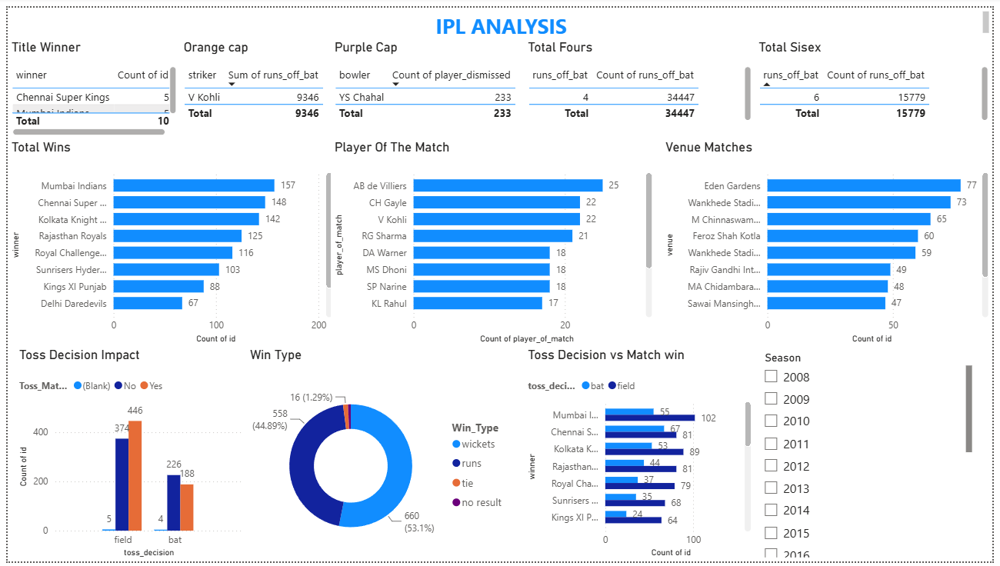
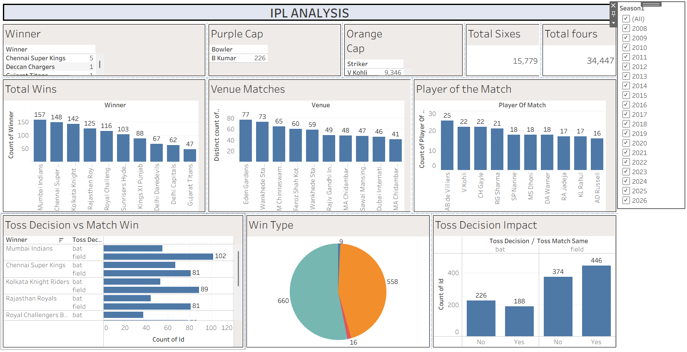

# 🏏 IPL Data Analysis (2008–2026)

An end-to-end data analysis and visualization project on the Indian Premier League, built using **Excel**, **Power BI** and **Tableau**. The project analyzes 1,243 matches and 295,000+ ball-by-ball deliveries across all IPL seasons from 2008 to 2026.

---

## 📌 Project Objectives

- Find out which teams and players have dominated the IPL over the years
- Study the impact of the **toss decision** (bat / field) on match results
- Identify top performers: **Orange Cap** (most runs) and **Purple Cap** (most wickets)
- Analyze boundary hitting (**fours and sixes**), venues, and **Player of the Match** awards
- Compare how matches are won: **by runs** vs **by wickets**

---

## 🗂️ Repository Structure

| File | Description |
|------|-------------|
| `IPL-Data.xlsx` | Cleaned dataset with derived columns used for analysis (`Toss_Match_Same`, `Win_Type`) |
| `IPL-Excel.xlsx` | Main dataset (matches + ball-by-ball deliveries) plus Excel Table and Dashboard sheets |
| `IPL-Powerbi.pbix` | Power BI dashboard |
| `IPL-Tableau.twb` | Tableau workbook with individual analysis sheets |
| `README.md` | Project documentation |

---

## 📊 Dataset Overview

| Sheet | Rows | Columns | Description |
|-------|------|---------|-------------|
| `matches_2008_2026` | 1,243 | 21 | One row per match: teams, venue, toss, result, winner, margin, umpires, Player of the Match |
| `deliveries_2008_2026` | 295,732 | 27 | One row per ball: batter, bowler, runs, extras, wickets, fielders |

**Key columns**

- *Matches:* `id`, `Season`, `city`, `venue`, `team1`, `team2`, `toss_winner`, `toss_decision`, `winner`, `win_by_runs`, `win_by_wickets`, `player_of_match`, `is_final`
- *Deliveries:* `match_id`, `innings`, `ball`, `batting_team`, `bowling_team`, `striker`, `bowler`, `runs_off_bat`, `extras`, `wicket_type`, `player_dismissed`

**Derived columns (in `IPL-Data.xlsx`)**

- `Toss_Match_Same`: whether the toss winner also won the match (Yes / No)
- `Win_Type`: whether the match was won by `runs` or `wickets`

---

## 📈 Dashboards & Analysis

### Tableau (`IPL-Tableau.twb`)

The workbook contains 11 worksheets:

1. Orange Cap
2. Purple Cap
3. Player of the Match
4. Total Wins
5. Winner
6. Total Fours
7. Total Sixes
8. Venue Matches
9. Toss Decision Impact
10. Toss Decision vs Match Win
11. Win Type

### Power BI (`IPL-Powerbi.pbix`)

A single-page interactive report with bar charts, a column chart, a donut chart, data tables, and a slicer for filtering.

### Excel

Pivot-style analysis and a dashboard sheet inside `IPL-Excel.xlsx`.

---

## 🛠️ Tools Used

- **Microsoft Excel** — data cleaning, derived columns, initial analysis
- **Power BI Desktop** — interactive dashboard
- **Tableau Desktop** — visual analysis worksheets

---

## 🚀 How to Use

1. Clone or download this repository:
   ```bash
   git clone https://github.com/pbhavii236-commits/IPL-Analysis.git
   ```
2. Open `IPL-Data.xlsx` or `IPL-Excel.xlsx` in Excel to explore the raw data.
3. Open `IPL-Powerbi.pbix` in **Power BI Desktop**.
4. Open `IPL-Tableau.twb` in **Tableau Desktop**.
   > If Tableau shows a missing data source error, click the data source and re-point it to the local `IPL-Data.xlsx` file.

---

## 🔍 Key Insights

> Add your own findings here after checking the dashboards. Some ideas:

- Which team has won the most matches and titles?
- Does winning the toss actually help win the match?
- Do teams prefer to bat or field first after winning the toss?
- Who are the all-time leaders in runs, wickets, fours and sixes?
- Which venues have hosted the most matches?

---

## 📸 Screenshots

> Add dashboard screenshots in a `Screenshots/` folder and link them here:

```markdown


```

---

## 👤 Author

**Bhavini**

- GitHub: [@Bhavini Patel](https://github.com/pbhavii236-commits)
---

## 📄 License

This project is for educational and portfolio purposes.
